# volto-slate
[](https://github.com/eea/volto-slate/releases)
[](https://ci.eionet.europa.eu/view/Github/job/volto-addons/job/volto-slate/job/master/display/redirect)
[](https://ci.eionet.europa.eu/view/Github/job/volto-addons/job/volto-slate/job/develop/display/redirect)

An alternative text editor for Volto, capable of completely replacing the default richtext editor while offering enhanced functionality and behavior. We believe that, in order to succeed, Volto's richtext form editor (the Volto Composite Page editor) needs strong integration between the rich text capabilities and the rest of the Volto blocks. Some examples of the kind of strong integration we have in mind:

- Pasting complex documents inside a volto-slate text block will create multiple Volto blocks: images will be converted to Volto Image blocks, tables will be converted to Volto Table blocks, etc.
- The text block accepts drag&drop images and it will upload them as Volto Image blocks.
- volto-slate has a Table button with the familiar size input, but it create a Table block

While this addon is still in an early alpha stage, we've solved most of the big issues, the API starts to stabilize and we've already started several addons based on it: https://github.com/eea/volto-slate-metadata-mentions/ and https://github.com/eea/volto-slate-zotero

## Note!

For maximum compatibility you should use this for Volto: `https://github.com/eea/volto/tree/modern_kitchen_sink` and register `volto-slate:asDefault` as an addon loader in package.json. See https://github.com/eea/volto-slate-project the demo project that we use to develop this addon.

## Why

Some of the main reasons that drove us to create volto-slate instead of enhancing Volto's draftjs implementation:

- Volto's draftjs implementation depends on draft-js-plugins, a third-party project that introduces its own set of bugs and maintanance issues
- Slate has a modern, developer-friendly api that makes developing plugins something easy to do. Getting the editor in a plugin is as easy as `const editor = useSlate()`, overriding core functionality is something that's built in as pluggable, directly in Slate.

- Volto's draft based implementation depends on Redraft for its final output, which comes with its own bugs and issues. While it is nice to have view-mode components, this is something that volto-slate implements just as well.
- Because Slate's internal storage uses a tree modeled on the DOM pattern, its final rendered output is very clean. Note: The Slate editor value is a JSON object, similar to the Draftjs based implementation.

## Features

#### 1. Hovering (floating) toolbar that shows up on selection
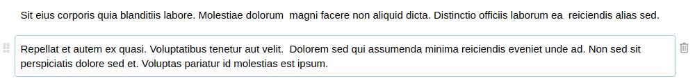

#### 2. Optional expanded (fixed) toolbar
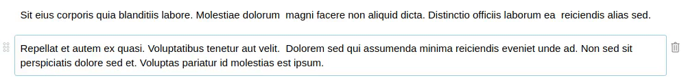

#### 3. Working with links (internal, external, email)
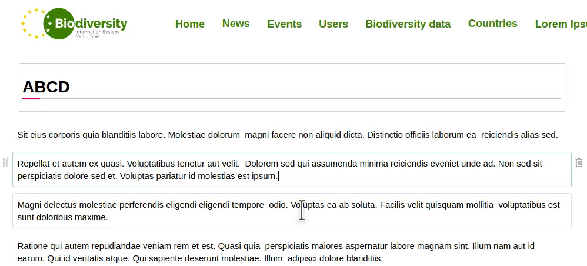

#### 4. Removing links
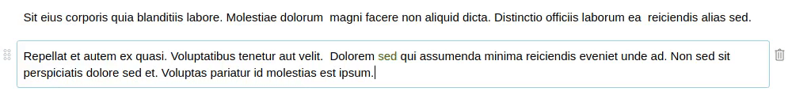

#### 5. Editing links
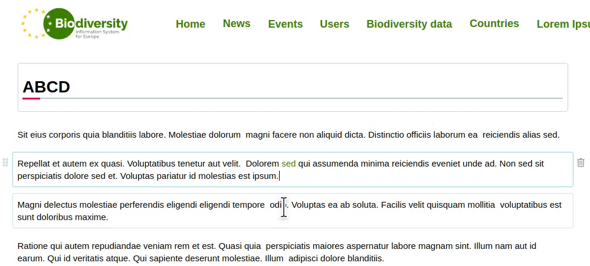

#### 6. Block-quotes
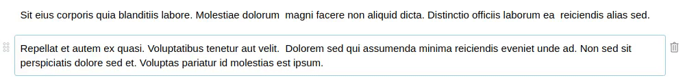

#### 7. Split paragraph block in two with `Enter` key and join them back with `Backspace` key
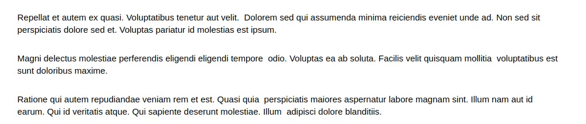

#### 8. Breaking and joining list items
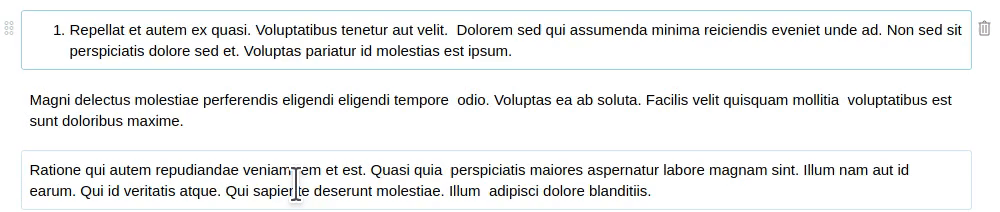

#### 9. Breaking (with expanded selection) and joining list items
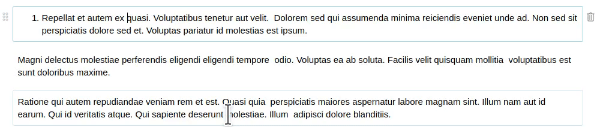

#### 10. Inserting a new list item at the end
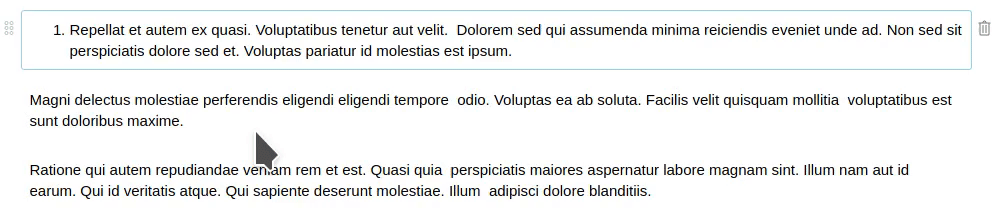

#### 11. Two `Enter` key presses in the last empty list item creates a new list
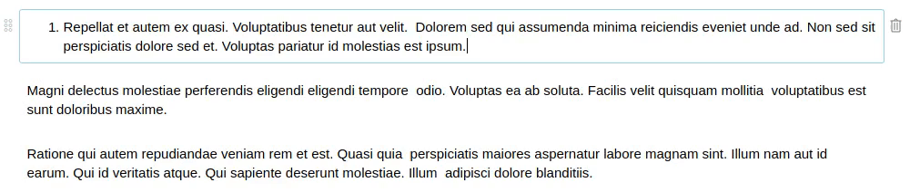

#### 12. Using `Up` and `Down` keys to go through the blocks in both directions
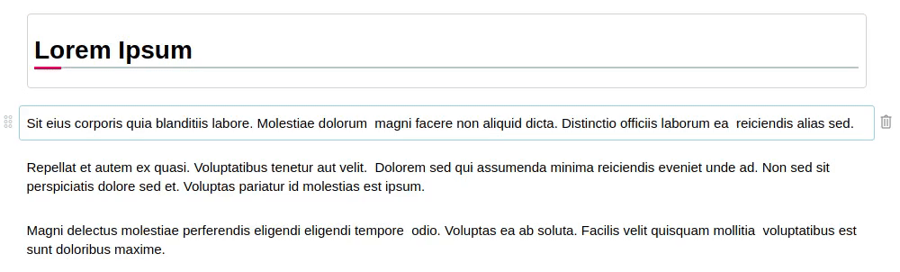

#### 13. Changing indent level of list items using `Tab` and `Shift-Tab` keys
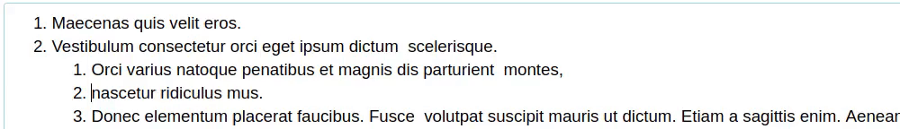

#### 14. Splitting a list block with `Enter` into two list blocks
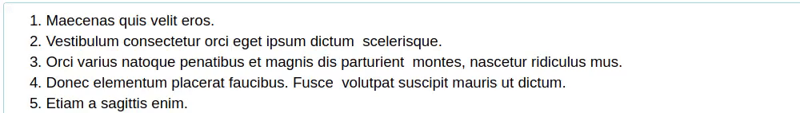

#### 15. Support for markdown bulleted lists with `*`, `-` and `+`
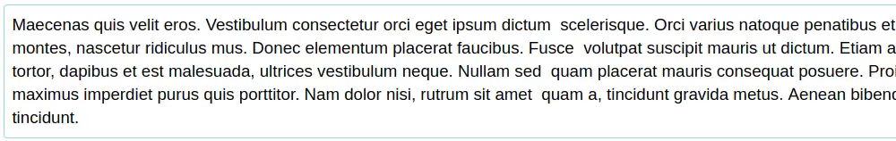

#### 16. Support for markdown numbered lists with `1.` - `9.`


#### 17. `Backspace` with cursor on first position inside a list with just one item converts the list to a paragraph
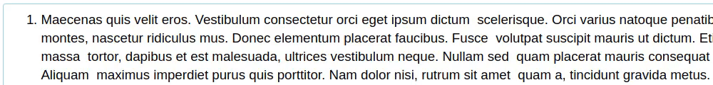

#### 18. Creating a new text block with `Enter` at the end of a text block and removing it with `Backspace`
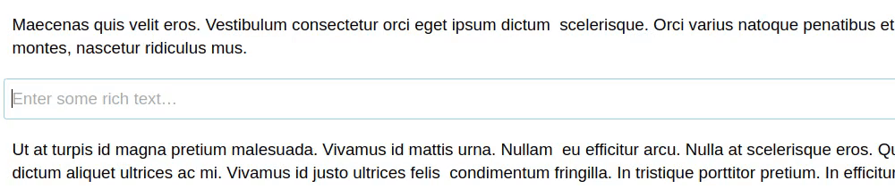

#### 19. Switching the list type (numbered list to/from bulleted list)
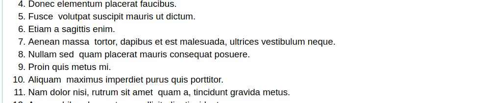

## Getting started

1. Create new volto project if you don't already have one:

   ```
   $ npm install -g yo @plone/generator-volto
   $ yo @plone/volto my-volto-project --addon @eeacms/volto-slate:asDefault

   $ cd my-volto-project
   $ yarn add -W @eeacms/volto-slate
   ```

1. If you already have a volto project, just update `package.json`:

   ```JSON
   "addons": [
       "@eeacms/volto-slate:asDefault"
   ],

   "dependencies": {
       "@eeacms/volto-slate": "^1.0.0"
   }
   ```

1. Install new add-ons and restart Volto:

   ```
   $ yarn
   $ yarn start
   ```

1. Go to http://localhost:3000

1. Happy editing!

## How to contribute

See [DEVELOP.md](https://github.com/eea/volto-slate/blob/master/DEVELOP.md).

## Credit

A lot of inspiration from the great [Slate Plugins repository](https://github.com/udecode/slate-plugins/), especially the autoformat handlers.

## Copyright and license

The Initial Owner of the Original Code is European Environment Agency (EEA).
All Rights Reserved.

See [LICENSE.md](https://github.com/eea/volto-slate/blob/master/LICENSE.md) for details.

## Funding

[European Environment Agency (EU)](http://eea.europa.eu)
